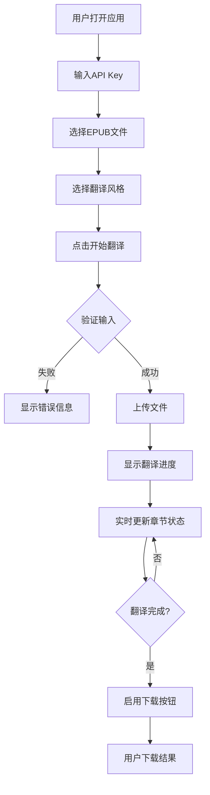

# 用户界面设计

## UI设计原则
- **简洁直观**：MVP阶段保持界面简单，避免功能堆砌
- **操作流畅**：清晰的操作流程，减少用户思考
- **实时反馈**：翻译进度和状态实时展示
- **错误友好**：错误信息清晰，提供解决方案

## 界面布局

### 整体布局结构
```
┌─────────────────────────────────────────────────────────┐
│                      EPUB 翻译器                         │
├─────────────────────────────────────────────────────────┤
│  ┌───────────────────┐  ┌─────────────────────────────┐ │
│  │                   │  │                             │ │
│  │   API 配置区      │  │      文件上传区             │ │
│  │                   │  │                             │ │
│  └───────────────────┘  └─────────────────────────────┘ │
│  ┌─────────────────────────────────────────────────────┐ │
│  │                                                     │ │
│  │                  进度显示区                          │ │
│  │                                                     │ │
│  └─────────────────────────────────────────────────────┘ │
│  ┌─────────────────────────────────────────────────────┐ │
│  │                  信息日志区                          │ │
│  └─────────────────────────────────────────────────────┘ │
└─────────────────────────────────────────────────────────┘
```

## 组件设计详情

### 1. API配置区
```tsx
interface APIConfigProps {
  onConfigChange: (config: APIConfig) => void
}

const APIConfigPanel: React.FC<APIConfigProps> = ({ onConfigChange }) => {
  return (
    <div className="bg-white rounded-lg shadow p-6">
      <h3 className="text-lg font-semibold mb-4">API 配置</h3>
      
      {/* API Key 输入 */}
      <div className="mb-4">
        <label className="block text-sm font-medium mb-2">
          Moonshot API Key
        </label>
        <input
          type="password"
          placeholder="请输入您的 API Key"
          className="w-full px-3 py-2 border rounded-md"
          onChange={(e) => onConfigChange({ apiKey: e.target.value })}
        />
        <p className="text-xs text-gray-500 mt-1">
          API Key 仅保存在本地，不会上传到服务器
        </p>
      </div>
      
      {/* 风格选择 */}
      <div className="mb-4">
        <label className="block text-sm font-medium mb-2">
          翻译风格
        </label>
        <select className="w-full px-3 py-2 border rounded-md">
          <option value="auto">自动检测</option>
          <option value="fiction">小说文学</option>
          <option value="science">科普学术</option>
          <option value="general">通用</option>
        </select>
      </div>
      
      {/* 高级选项（折叠） */}
      <details className="mt-4">
        <summary className="cursor-pointer text-sm text-blue-600">
          高级选项
        </summary>
        <div className="mt-2 space-y-2">
          <label className="flex items-center">
            <input type="checkbox" className="mr-2" />
            <span className="text-sm">保留原文对照</span>
          </label>
          <label className="flex items-center">
            <input type="checkbox" className="mr-2" />
            <span className="text-sm">启用上下文优化</span>
          </label>
        </div>
      </details>
    </div>
  )
}
```

### 2. 文件上传区
```tsx
const FileUploadArea: React.FC = () => {
  const [file, setFile] = useState<File | null>(null)
  const [isDragging, setIsDragging] = useState(false)
  
  return (
    <div className="bg-white rounded-lg shadow p-6">
      <h3 className="text-lg font-semibold mb-4">上传 EPUB 文件</h3>
      
      {/* 拖拽上传区 */}
      <div
        className={`
          border-2 border-dashed rounded-lg p-8 text-center
          transition-colors cursor-pointer
          ${isDragging ? 'border-blue-500 bg-blue-50' : 'border-gray-300'}
          ${file ? 'bg-green-50' : 'hover:border-gray-400'}
        `}
        onDragOver={(e) => {
          e.preventDefault()
          setIsDragging(true)
        }}
        onDragLeave={() => setIsDragging(false)}
        onDrop={(e) => {
          e.preventDefault()
          setIsDragging(false)
          const droppedFile = e.dataTransfer.files[0]
          if (droppedFile?.name.endsWith('.epub')) {
            setFile(droppedFile)
          }
        }}
      >
        {file ? (
          <div>
            <FileIcon className="w-12 h-12 mx-auto mb-2 text-green-600" />
            <p className="font-medium">{file.name}</p>
            <p className="text-sm text-gray-500">
              {(file.size / 1024 / 1024).toFixed(2)} MB
            </p>
            <button className="mt-2 text-sm text-red-600 hover:underline">
              移除文件
            </button>
          </div>
        ) : (
          <div>
            <UploadIcon className="w-12 h-12 mx-auto mb-2 text-gray-400" />
            <p className="text-gray-600">
              拖拽 EPUB 文件到此处，或点击选择文件
            </p>
            <input
              type="file"
              accept=".epub"
              className="hidden"
              onChange={(e) => setFile(e.target.files?.[0] || null)}
            />
          </div>
        )}
      </div>
      
      {/* 开始翻译按钮 */}
      <button
        className={`
          w-full mt-4 py-2 px-4 rounded-md font-medium
          transition-colors
          ${file ? 
            'bg-blue-600 text-white hover:bg-blue-700' : 
            'bg-gray-200 text-gray-400 cursor-not-allowed'
          }
        `}
        disabled={!file}
      >
        开始翻译
      </button>
    </div>
  )
}
```

### 3. 进度显示区
```tsx
interface ProgressPanelProps {
  progress: TranslationProgress
  chapters: ChapterProgress[]
}

const ProgressPanel: React.FC<ProgressPanelProps> = ({ progress, chapters }) => {
  return (
    <div className="bg-white rounded-lg shadow p-6">
      <h3 className="text-lg font-semibold mb-4">翻译进度</h3>
      
      {/* 总进度条 */}
      <div className="mb-6">
        <div className="flex justify-between text-sm mb-1">
          <span>总进度</span>
          <span>{progress.percentage}%</span>
        </div>
        <div className="w-full bg-gray-200 rounded-full h-3">
          <div
            className="bg-blue-600 h-3 rounded-full transition-all"
            style={{ width: `${progress.percentage}%` }}
          />
        </div>
        <p className="text-sm text-gray-500 mt-1">
          已完成 {progress.completed}/{progress.total} 章节
        </p>
      </div>
      
      {/* 章节列表 */}
      <div className="space-y-2 max-h-60 overflow-y-auto">
        {chapters.map((chapter) => (
          <div key={chapter.id} className="flex items-center space-x-3">
            <div className="flex-shrink-0">
              {chapter.status === 'completed' && (
                <CheckIcon className="w-5 h-5 text-green-600" />
              )}
              {chapter.status === 'processing' && (
                <LoadingIcon className="w-5 h-5 text-blue-600 animate-spin" />
              )}
              {chapter.status === 'pending' && (
                <ClockIcon className="w-5 h-5 text-gray-400" />
              )}
              {chapter.status === 'error' && (
                <ErrorIcon className="w-5 h-5 text-red-600" />
              )}
            </div>
            <div className="flex-1">
              <p className="text-sm font-medium">{chapter.title}</p>
              {chapter.status === 'processing' && (
                <div className="w-full bg-gray-200 rounded-full h-1 mt-1">
                  <div
                    className="bg-blue-600 h-1 rounded-full"
                    style={{ width: `${chapter.progress}%` }}
                  />
                </div>
              )}
            </div>
          </div>
        ))}
      </div>
      
      {/* 下载按钮 */}
      {progress.status === 'completed' && (
        <button className="w-full mt-4 py-2 px-4 bg-green-600 text-white rounded-md hover:bg-green-700">
          下载翻译结果
        </button>
      )}
    </div>
  )
}
```

### 4. 信息日志区
```tsx
interface LogEntry {
  id: string
  timestamp: Date
  level: 'info' | 'warning' | 'error'
  message: string
}

const LogPanel: React.FC<{ logs: LogEntry[] }> = ({ logs }) => {
  const logEndRef = useRef<HTMLDivElement>(null)
  
  useEffect(() => {
    // 自动滚动到最新日志
    logEndRef.current?.scrollIntoView({ behavior: 'smooth' })
  }, [logs])
  
  return (
    <div className="bg-gray-50 rounded-lg p-4">
      <h4 className="text-sm font-semibold mb-2">系统日志</h4>
      <div className="bg-white rounded border h-32 overflow-y-auto p-2 font-mono text-xs">
        {logs.map((log) => (
          <div
            key={log.id}
            className={`
              mb-1
              ${log.level === 'error' ? 'text-red-600' : ''}
              ${log.level === 'warning' ? 'text-yellow-600' : ''}
              ${log.level === 'info' ? 'text-gray-600' : ''}
            `}
          >
            <span className="text-gray-400">
              [{log.timestamp.toLocaleTimeString()}]
            </span>
            {' '}
            <span>{log.message}</span>
          </div>
        ))}
        <div ref={logEndRef} />
      </div>
    </div>
  )
}
```

## 交互流程设计

### 翻译流程


### 错误处理流程
1. **API Key 错误**：弹出提示，高亮输入框
2. **文件格式错误**：上传时立即提示，不接受文件
3. **网络错误**：显示重试按钮，保存进度
4. **翻译错误**：标记失败章节，允许单独重试

## 响应式设计

### 移动端适配
```css
/* 移动端布局 */
@media (max-width: 768px) {
  .container {
    grid-template-columns: 1fr;
  }
  
  .api-config {
    margin-bottom: 1rem;
  }
  
  .progress-panel {
    max-height: 200px;
  }
}
```

### 深色模式支持
```tsx
// 使用 CSS 变量支持深色模式
const themes = {
  light: {
    '--bg-primary': '#ffffff',
    '--bg-secondary': '#f3f4f6',
    '--text-primary': '#111827',
    '--text-secondary': '#6b7280',
  },
  dark: {
    '--bg-primary': '#1f2937',
    '--bg-secondary': '#111827',
    '--text-primary': '#f9fafb',
    '--text-secondary': '#9ca3af',
  }
}
```

## 动画和过渡

### 关键动画
1. **文件拖拽**：边框颜色过渡，背景色淡入
2. **进度条**：平滑过渡，数字跳动
3. **状态图标**：旋转加载，淡入淡出
4. **日志滚动**：平滑滚动到底部

### 加载状态
```tsx
const LoadingOverlay: React.FC<{ message: string }> = ({ message }) => {
  return (
    <div className="fixed inset-0 bg-black bg-opacity-50 flex items-center justify-center z-50">
      <div className="bg-white rounded-lg p-6 flex items-center space-x-4">
        <LoadingIcon className="w-8 h-8 animate-spin text-blue-600" />
        <span className="text-lg">{message}</span>
      </div>
    </div>
  )
}
```

## 调试功能

### 开发者工具
1. **网络请求监控**：显示API调用详情
2. **性能监控**：显示每章翻译耗时
3. **错误详情**：完整错误堆栈（开发模式）
4. **模拟模式**：不调用真实API的测试模式

### 调试面板
```tsx
const DebugPanel: React.FC = () => {
  if (process.env.NODE_ENV !== 'development') return null
  
  return (
    <div className="fixed bottom-4 right-4 bg-black bg-opacity-80 text-white p-4 rounded-lg text-xs">
      <h4 className="font-bold mb-2">调试信息</h4>
      <div>内存使用: {performance.memory?.usedJSHeapSize}</div>
      <div>活动连接: {activeConnections}</div>
      <div>翻译队列: {queue.length}</div>
    </div>
  )
}
```