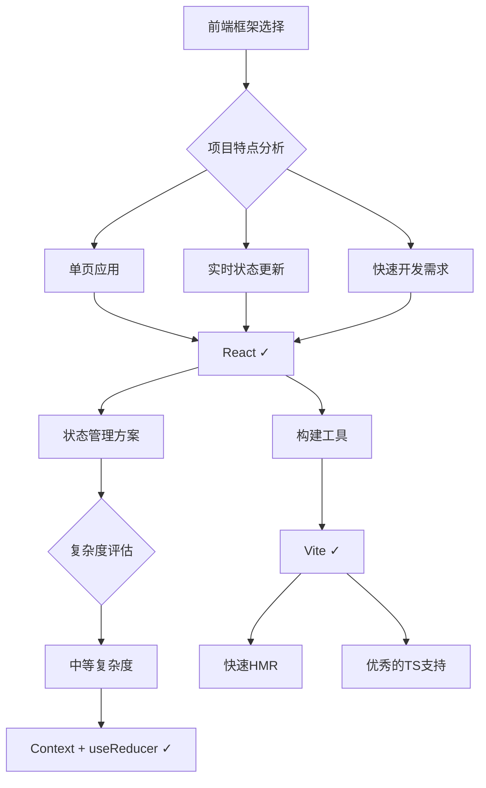
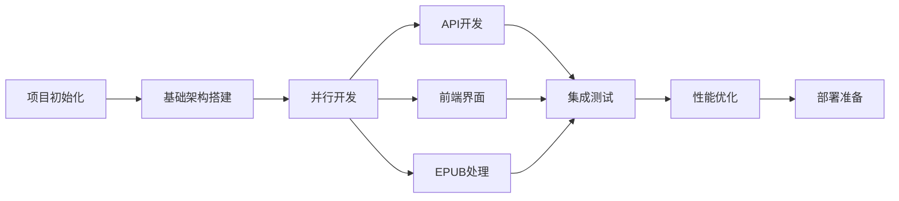
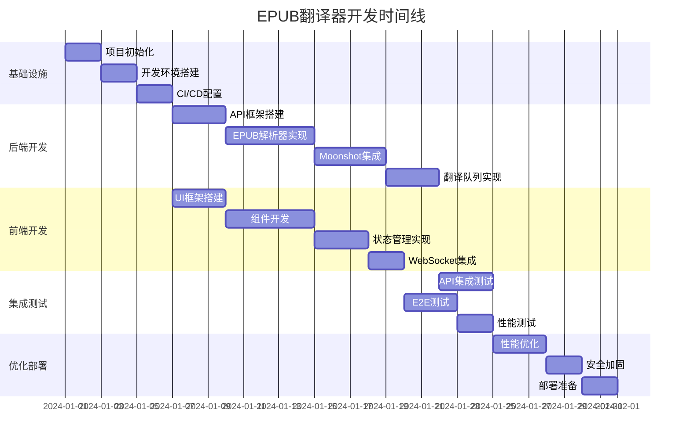

# EPUB翻译器开发深度分析 (UltraThink)

## 🧠 深度技术分析概览

本文档通过深度分析为EPUB翻译器项目提供全面的开发指导，包括技术选型理由、潜在风险、优化策略和具体实现路径。

## 1. 技术栈深度分析与选择理由

### 1.1 前端技术栈决策树



**深度分析：为什么选择React + Vite？**

1. **React的优势**：
   - 组件化架构完美匹配UI需求（上传区、进度显示、配置面板）
   - Hooks简化状态管理（useEffect处理WebSocket，useState管理表单）
   - 成熟的生态系统（react-dropzone处理文件上传）
   - 虚拟DOM适合频繁更新的进度显示

2. **Vite的优势**：
   - 即时模块热更新（<50ms），提高开发效率
   - 原生ES模块支持，开发环境启动速度快
   - 优秀的TypeScript支持，零配置
   - 生产构建使用Rollup，输出体积小

3. **潜在风险与缓解**：
   - **风险**：React体积较大（~45KB gzipped）
   - **缓解**：使用代码分割，懒加载非核心组件
   - **风险**：状态管理可能变复杂
   - **缓解**：预设升级路径到Zustand/Jotai

### 1.2 后端技术栈深度考量

```typescript
// 技术选型评分矩阵
const backendOptions = {
  'Node.js + Express': {
    scores: {
      epubProcessing: 9,  // 丰富的npm包
      performance: 8,     // 单线程但足够
      deployment: 9,      // 容易部署
      maintenance: 9      // JS全栈
    },
    risks: ['CPU密集型任务阻塞', '内存管理'],
    mitigations: ['Worker Threads', '流式处理']
  },
  'Python + FastAPI': {
    scores: {
      epubProcessing: 7,  // 库较少
      performance: 9,     // 异步性能好
      deployment: 7,      // 需要更多配置
      maintenance: 6      // 需要双语言栈
    }
  },
  'Go + Gin': {
    scores: {
      epubProcessing: 5,  // 库最少
      performance: 10,    // 性能最佳
      deployment: 8,      // 单二进制
      maintenance: 5      // 学习曲线陡
    }
  }
}
```

**结论**：Node.js + Express 最适合MVP，因为：
1. npm生态有成熟的EPUB处理库
2. 与前端共享TypeScript代码
3. 部署简单，适合快速迭代

### 1.3 关键库选择深度分析

#### EPUB处理库对比
```javascript
// 三个主要候选库的深度对比
const epubLibraries = {
  'epub': {
    pros: ['纯JS实现', '轻量级', 'API简单'],
    cons: ['功能有限', '不支持EPUB3'],
    useCase: 'MVP快速开发'
  },
  'epub.js': {
    pros: ['功能完整', '浏览器支持', 'EPUB3支持'],
    cons: ['体积大', '主要为渲染设计'],
    useCase: '需要预览功能时'
  },
  'node-epub-parser': {
    pros: ['专注解析', '性能好', '可扩展'],
    cons: ['文档少', '社区小'],
    useCase: '生产环境'
  }
}

// 推荐方案：分阶段使用
const strategy = {
  mvp: 'epub',  // 快速启动
  v2: 'node-epub-parser',  // 性能优化
  future: 'custom-parser'  // 完全控制
}
```

## 2. EPUB处理技术挑战深度分析

### 2.1 EPUB文件结构复杂性

```typescript
// EPUB内部结构示例
interface EPUBStructure {
  'mimetype': 'application/epub+zip',  // 必须是第一个文件
  'META-INF/': {
    'container.xml': 'rootfile位置',
    'encryption.xml'?: 'DRM信息',
    'manifest.xml'?: '文件清单'
  },
  'OEBPS/': {  // 或 EPUB/
    'content.opf': 'spine + manifest',
    'toc.ncx': '目录结构',
    'toc.xhtml'?: 'EPUB3目录',
    'Text/': {
      'chapter1.xhtml': '章节内容',
      'chapter2.xhtml': '章节内容'
    },
    'Images/': {},
    'Styles/': {}
  }
}
```

**关键挑战与解决方案**：

1. **挑战：保持文档结构完整性**
   ```typescript
   class EPUBIntegrityManager {
     private checksums: Map<string, string> = new Map()
     
     async validateStructure(epub: ParsedEPUB): Promise<ValidationResult> {
       // 1. 验证必要文件存在
       const requiredFiles = ['mimetype', 'META-INF/container.xml']
       
       // 2. 验证引用完整性
       const brokenLinks = await this.findBrokenReferences(epub)
       
       // 3. 验证编码一致性
       const encodingIssues = await this.checkEncodings(epub)
       
       return { isValid, issues, suggestions }
     }
   }
   ```

2. **挑战：处理不同EPUB版本**
   ```typescript
   class EPUBVersionAdapter {
     async normalize(epub: RawEPUB): Promise<NormalizedEPUB> {
       const version = this.detectVersion(epub)
       
       switch(version) {
         case '2.0':
           return this.normalizeEPUB2(epub)
         case '3.0':
         case '3.1':
         case '3.2':
           return this.normalizeEPUB3(epub)
         default:
           throw new Error(`Unsupported EPUB version: ${version}`)
       }
     }
     
     private normalizeEPUB2(epub: RawEPUB): NormalizedEPUB {
       // 转换 NCX 到 Nav Doc
       // 处理 DTBook 内容
       // 升级元数据格式
     }
   }
   ```

3. **挑战：保持图片和样式引用**
   ```typescript
   class ReferencePreserver {
     private referenceMap = new Map<string, string>()
     
     preserveReferences(originalHtml: string, translatedText: string): string {
       // 1. 提取所有引用
       const refs = this.extractReferences(originalHtml)
       
       // 2. 创建占位符
       const placeholders = refs.map((ref, i) => ({
         placeholder: `__REF_${i}__`,
         original: ref
       }))
       
       // 3. 翻译时保护占位符
       let protectedText = originalHtml
       placeholders.forEach(p => {
         protectedText = protectedText.replace(p.original, p.placeholder)
       })
       
       // 4. 恢复引用
       let finalHtml = translatedText
       placeholders.forEach(p => {
         finalHtml = finalHtml.replace(p.placeholder, p.original)
       })
       
       return finalHtml
     }
   }
   ```

### 2.2 大文件处理的内存优化

```typescript
// 流式处理大型EPUB文件
class StreamingEPUBProcessor {
  async processLargeEPUB(filePath: string): AsyncGenerator<Chapter> {
    const zip = new StreamZip.async({ file: filePath })
    
    try {
      // 1. 先读取必要的元数据
      const metadata = await this.readMetadata(zip)
      
      // 2. 获取章节列表但不加载内容
      const chapterPaths = await this.getChapterPaths(zip, metadata)
      
      // 3. 逐个流式处理章节
      for (const path of chapterPaths) {
        const stream = await zip.stream(path)
        const content = await this.streamToString(stream)
        
        yield {
          path,
          content,
          // 立即释放内存
          cleanup: () => stream.destroy()
        }
      }
    } finally {
      await zip.close()
    }
  }
  
  // 内存使用监控
  private memoryMonitor = {
    checkMemory(): void {
      const usage = process.memoryUsage()
      if (usage.heapUsed > 400 * 1024 * 1024) { // 400MB
        global.gc?.() // 如果可用，强制GC
        console.warn('High memory usage detected')
      }
    }
  }
}
```

## 3. Moonshot API集成最佳实践

### 3.1 智能速率限制和队列管理

```typescript
class IntelligentRateLimiter {
  private requestHistory: RequestRecord[] = []
  private quotaInfo = {
    rpm: 10,  // 每分钟请求数
    tpm: 100000,  // 每分钟token数
    concurrency: 3  // 并发数
  }
  
  async executeWithIntelligentThrottling<T>(
    request: () => Promise<T>,
    estimatedTokens: number
  ): Promise<T> {
    // 1. 预测等待时间
    const waitTime = this.calculateOptimalWaitTime(estimatedTokens)
    
    // 2. 动态调整并发
    const concurrency = this.adjustConcurrency()
    
    // 3. 智能重试策略
    return this.executeWithBackoff(request, {
      initialDelay: waitTime,
      maxAttempts: 3,
      backoffFactor: 2,
      jitter: true  // 添加随机性避免同步重试
    })
  }
  
  private calculateOptimalWaitTime(tokens: number): number {
    const now = Date.now()
    const recentRequests = this.requestHistory.filter(
      r => now - r.timestamp < 60000
    )
    
    // 计算当前使用率
    const currentRPM = recentRequests.length
    const currentTPM = recentRequests.reduce((sum, r) => sum + r.tokens, 0)
    
    // 智能等待时间计算
    if (currentRPM >= this.quotaInfo.rpm * 0.8) {
      return (60000 / this.quotaInfo.rpm) * 1.2  // 留20%余量
    }
    
    if (currentTPM + tokens > this.quotaInfo.tpm * 0.8) {
      const tokenWaitTime = (currentTPM + tokens - this.quotaInfo.tpm * 0.8) / 
                           (this.quotaInfo.tpm / 60000)
      return Math.max(tokenWaitTime, 1000)
    }
    
    return 0  // 无需等待
  }
}
```

### 3.2 高级提示词工程

```typescript
class AdvancedPromptEngineering {
  // 上下文感知的提示词生成
  generateContextAwarePrompt(
    text: string,
    style: ContentStyle,
    context: TranslationContext
  ): PromptTemplate {
    const basePrompt = this.getBasePrompt(style)
    
    // 1. 动态调整基于内容特征
    const features = this.extractTextFeatures(text)
    const adjustedPrompt = this.adjustPromptByFeatures(basePrompt, features)
    
    // 2. 添加上下文线索
    if (context.previousTranslations.length > 0) {
      adjustedPrompt.system += this.generateContextHint(context)
    }
    
    // 3. 特殊内容处理指令
    if (features.hasDialogue) {
      adjustedPrompt.user += '\n注意：保持对话的自然性和角色特征。'
    }
    
    if (features.hasTechnicalTerms) {
      adjustedPrompt.user += '\n注意：技术术语请使用标准译法，首次出现可括号注明原文。'
    }
    
    return adjustedPrompt
  }
  
  private extractTextFeatures(text: string): TextFeatures {
    return {
      hasDialogue: /["'].*?["']/.test(text),
      hasTechnicalTerms: this.detectTechnicalTerms(text),
      sentenceComplexity: this.calculateComplexity(text),
      dominantTense: this.detectTense(text),
      formalityLevel: this.assessFormality(text)
    }
  }
  
  // 翻译质量自动评估
  async evaluateTranslationQuality(
    original: string,
    translated: string,
    style: ContentStyle
  ): Promise<QualityScore> {
    const metrics = {
      fluency: await this.assessFluency(translated),
      accuracy: this.compareSemanticSimilarity(original, translated),
      styleConsistency: this.checkStyleConsistency(translated, style),
      terminology: this.validateTerminology(original, translated)
    }
    
    const overallScore = Object.values(metrics).reduce((a, b) => a + b) / 4
    
    return {
      score: overallScore,
      metrics,
      suggestions: this.generateImprovementSuggestions(metrics)
    }
  }
}
```

### 3.3 错误恢复和降级策略

```typescript
class RobustTranslationManager {
  private fallbackStrategies = [
    {
      name: 'retry-with-smaller-chunk',
      condition: (error) => error.code === 'context_length_exceeded',
      action: async (chunk, context) => {
        const subChunks = this.splitChunk(chunk, 0.5)  // 分成更小的块
        return Promise.all(subChunks.map(sc => this.translate(sc, context)))
      }
    },
    {
      name: 'simplify-prompt',
      condition: (error) => error.code === 'rate_limit_exceeded',
      action: async (chunk, context) => {
        const simplifiedContext = { ...context, promptComplexity: 'minimal' }
        await this.delay(60000)  // 等待1分钟
        return this.translate(chunk, simplifiedContext)
      }
    },
    {
      name: 'use-cached-similar',
      condition: (error) => error.code === 'service_unavailable',
      action: async (chunk, context) => {
        const similar = await this.findSimilarTranslation(chunk)
        if (similar) {
          return this.adaptSimilarTranslation(similar, chunk)
        }
        throw error  // 无法降级
      }
    }
  ]
  
  async translateWithFallback(
    chunk: string,
    context: TranslationContext
  ): Promise<string> {
    let lastError: Error
    
    try {
      return await this.primaryTranslate(chunk, context)
    } catch (error) {
      lastError = error as Error
      
      // 尝试所有降级策略
      for (const strategy of this.fallbackStrategies) {
        if (strategy.condition(error)) {
          try {
            console.log(`Applying fallback strategy: ${strategy.name}`)
            return await strategy.action(chunk, context)
          } catch (fallbackError) {
            console.error(`Fallback ${strategy.name} failed:`, fallbackError)
          }
        }
      }
      
      throw lastError
    }
  }
}
```

## 4. 前后端开发流程和关键决策点

### 4.1 开发流程优化



**关键决策点深度分析**：

1. **决策点1：Mock API vs 真实API开发顺序**
   ```typescript
   // 推荐方案：Contract-First Development
   // 1. 先定义API契约
   const apiContract = {
     '/api/translate': {
       request: {
         body: TranslateRequest
       },
       response: {
         200: TranslateResponse,
         429: RateLimitError,
         500: ServerError
       }
     }
   }
   
   // 2. 生成Mock服务器
   const mockServer = createMockServer(apiContract)
   
   // 3. 前端基于Mock开发
   // 4. 后端实现真实API
   // 5. 无缝切换
   ```

2. **决策点2：状态管理演进策略**
   ```typescript
   // 阶段1：useState + Context (MVP)
   const TranslationContext = createContext<TranslationState>()
   
   // 阶段2：useReducer (复杂状态)
   const translationReducer = (state, action) => {
     switch(action.type) {
       case 'START_TRANSLATION':
       case 'UPDATE_PROGRESS':
       case 'COMPLETE_CHAPTER':
       // ...
     }
   }
   
   // 阶段3：Zustand (需要时)
   const useTranslationStore = create((set) => ({
     // 更复杂的状态管理
   }))
   ```

3. **决策点3：性能优化时机**
   ```typescript
   class PerformanceOptimizationStrategy {
     // 监控指标
     metrics = {
       renderTime: [],
       apiLatency: [],
       memoryUsage: []
     }
     
     shouldOptimize(): OptimizationPlan {
       const avgRenderTime = average(this.metrics.renderTime)
       
       if (avgRenderTime > 16) {  // 超过60fps阈值
         return {
           priority: 'high',
           suggestions: [
             'React.memo for ProgressPanel',
             'Virtual scrolling for chapter list',
             'Debounce progress updates'
           ]
         }
       }
       
       return null
     }
   }
   ```

### 4.2 关键技术决策树

```typescript
// 技术决策自动化工具
class TechnicalDecisionEngine {
  decisions = {
    'websocket-vs-polling': {
      factors: {
        realtimeRequirement: 0.8,
        browserCompatibility: 0.2,
        serverResources: 0.5
      },
      evaluate: (context) => {
        const score = this.weightedScore(this.factors, context)
        return score > 0.6 ? 'websocket' : 'polling'
      }
    },
    
    'chunk-size-optimization': {
      factors: {
        apiLatency: 0.4,
        tokenLimit: 0.4,
        contextCoherence: 0.2
      },
      evaluate: (context) => {
        const optimal = Math.min(
          context.tokenLimit * 0.7,  // 留余量
          2000 - context.avgPromptLength,
          context.p95ResponseTime < 5000 ? 1500 : 1000
        )
        return optimal
      }
    }
  }
}
```

## 5. 测试策略深度分析

### 5.1 分层测试架构

```typescript
// 测试金字塔实现
class TestingStrategy {
  layers = {
    unit: {
      coverage: 80,
      tools: ['Jest', 'React Testing Library'],
      focus: ['纯函数', '组件逻辑', '工具类'],
      example: `
        test('EPUBChunker splits text correctly', () => {
          const chunker = new EPUBChunker(1000)
          const text = 'long text...'
          const chunks = chunker.chunk(text)
          
          expect(chunks).toHaveLength(3)
          expect(chunks[0].length).toBeLessThanOrEqual(1000)
          expect(chunks.join('')).toBe(text)
        })
      `
    },
    
    integration: {
      coverage: 60,
      tools: ['Supertest', 'MSW'],
      focus: ['API端点', '数据库交互', '外部服务'],
      example: `
        test('Translation API handles rate limits', async () => {
          const server = createTestServer()
          
          // 触发限流
          for (let i = 0; i < 11; i++) {
            await request(server).post('/api/translate')
          }
          
          const response = await request(server)
            .post('/api/translate')
            .expect(429)
            
          expect(response.body.retryAfter).toBeDefined()
        })
      `
    },
    
    e2e: {
      coverage: 20,
      tools: ['Playwright'],
      focus: ['关键用户流程', '跨浏览器兼容性'],
      example: `
        test('Complete translation workflow', async ({ page }) => {
          await page.goto('/')
          
          // 上传文件
          await page.setInputFiles('#file-upload', 'test.epub')
          
          // 输入API key
          await page.fill('#api-key', process.env.TEST_API_KEY)
          
          // 开始翻译
          await page.click('#start-translation')
          
          // 等待完成
          await page.waitForSelector('#download-button', {
            timeout: 60000
          })
          
          // 验证下载
          const download = await page.waitForEvent('download')
          expect(download.suggestedFilename()).toContain('translated')
        })
      `
    }
  }
}
```

### 5.2 测试数据策略

```typescript
class TestDataManager {
  // 测试EPUB生成器
  generateTestEPUB(options: TestEPUBOptions): Buffer {
    const chapters = this.generateChapters(options)
    const metadata = this.generateMetadata(options)
    
    return this.packageAsEPUB(chapters, metadata)
  }
  
  // 边界测试用例
  edgeCases = {
    emptyChapter: this.generateTestEPUB({ chapters: 1, wordsPerChapter: 0 }),
    hugeChapter: this.generateTestEPUB({ chapters: 1, wordsPerChapter: 10000 }),
    manyChapters: this.generateTestEPUB({ chapters: 100, wordsPerChapter: 100 }),
    specialChars: this.generateTestEPUB({ 
      content: 'Special chars: "quotes" 'apostrophe' —em-dash–'
    }),
    mixedContent: this.generateTestEPUB({
      includeImages: true,
      includeTables: true,
      includeCode: true
    })
  }
}
```

## 6. 部署和运维深度考虑

### 6.1 容器化策略

```dockerfile
# 多阶段构建优化
FROM node:18-alpine AS deps
WORKDIR /app
COPY package*.json ./
# 仅安装生产依赖
RUN npm ci --only=production

FROM node:18-alpine AS builder
WORKDIR /app
COPY package*.json ./
RUN npm ci
COPY . .
RUN npm run build

FROM node:18-alpine AS runner
WORKDIR /app

# 安全性：非root用户
RUN addgroup -g 1001 -S nodejs
RUN adduser -S nodejs -u 1001

# 仅复制必要文件
COPY --from=deps /app/node_modules ./node_modules
COPY --from=builder /app/dist ./dist
COPY --from=builder /app/public ./public

USER nodejs

EXPOSE 3000

# 健康检查
HEALTHCHECK --interval=30s --timeout=3s --start-period=5s --retries=3 \
  CMD node healthcheck.js

CMD ["node", "dist/index.js"]
```

### 6.2 监控和可观测性

```typescript
class ObservabilitySetup {
  // 关键指标定义
  metrics = {
    business: [
      'translation_requests_total',
      'translation_success_rate',
      'average_translation_time',
      'chapters_per_minute'
    ],
    
    technical: [
      'api_latency_histogram',
      'memory_usage_gauge',
      'active_connections_gauge',
      'error_rate_by_type'
    ],
    
    slo: {
      availability: 99.5,  // 月度
      latency_p95: 5000,   // 毫秒
      error_rate: 0.01     // 1%
    }
  }
  
  // 日志策略
  loggingStrategy = {
    levels: {
      error: '所有错误必须包含stack trace和context',
      warn: 'rate limit接近、内存使用高',
      info: '翻译任务开始/结束、章节完成',
      debug: '详细的API调用、chunk处理'
    },
    
    structuredFormat: {
      timestamp: 'ISO8601',
      level: 'string',
      message: 'string',
      context: {
        taskId: 'string',
        chapterId: 'string',
        userId: 'string'
      }
    }
  }
}
```

## 7. 性能优化深度策略

### 7.1 前端性能优化

```typescript
// React性能优化清单
class FrontendOptimizations {
  // 1. 组件层优化
  memoization = {
    ProgressPanel: React.memo(ProgressPanel, (prev, next) => {
      // 仅在进度实际变化时重渲染
      return prev.progress === next.progress
    }),
    
    ChapterList: ({ chapters }) => {
      // 虚拟滚动处理大量章节
      return <VirtualList
        items={chapters}
        itemHeight={60}
        renderItem={Chapter}
      />
    }
  }
  
  // 2. 状态更新优化
  progressThrottling = {
    useThrottledProgress: (progress) => {
      const [throttled, setThrottled] = useState(progress)
      const timeoutRef = useRef(null)
      
      useEffect(() => {
        if (timeoutRef.current) clearTimeout(timeoutRef.current)
        
        timeoutRef.current = setTimeout(() => {
          setThrottled(progress)
        }, 100)  // 最多10fps更新
        
        return () => clearTimeout(timeoutRef.current)
      }, [progress])
      
      return throttled
    }
  }
  
  // 3. 资源加载优化
  bundleOptimization = {
    lazy: {
      SettingsModal: lazy(() => import('./SettingsModal')),
      HelpDocumentation: lazy(() => import('./HelpDocumentation'))
    },
    
    preload: [
      'main.css',
      'api-service.js'
    ],
    
    prefetch: [
      'settings-chunk.js',
      'help-chunk.js'
    ]
  }
}
```

### 7.2 后端性能优化

```typescript
class BackendOptimizations {
  // 1. 缓存策略
  caching = {
    translationCache: new LRUCache<string, string>({
      max: 1000,
      ttl: 1000 * 60 * 60 * 24,  // 24小时
      updateAgeOnGet: true
    }),
    
    // 智能缓存键生成
    getCacheKey: (text: string, style: ContentStyle): string => {
      const hash = crypto.createHash('sha256')
      hash.update(text)
      hash.update(style)
      return hash.digest('hex')
    }
  }
  
  // 2. 并发控制
  concurrencyControl = {
    // 动态调整并发数
    adaptiveConcurrency: class {
      private currentConcurrency = 3
      private latencyHistory: number[] = []
      
      adjust(): number {
        const avgLatency = average(this.latencyHistory.slice(-10))
        
        if (avgLatency < 2000 && this.currentConcurrency < 5) {
          this.currentConcurrency++
        } else if (avgLatency > 5000 && this.currentConcurrency > 1) {
          this.currentConcurrency--
        }
        
        return this.currentConcurrency
      }
    }
  }
  
  // 3. 数据库查询优化
  queryOptimization = {
    // 批量操作
    batchInsertTranslations: async (translations: Translation[]) => {
      const query = `
        INSERT INTO translations (chapter_id, original, translated, created_at)
        VALUES ${translations.map(() => '(?, ?, ?, ?)').join(', ')}
      `
      const values = translations.flatMap(t => [
        t.chapterId, t.original, t.translated, new Date()
      ])
      
      await db.execute(query, values)
    }
  }
}
```

## 8. 安全性深度考虑

### 8.1 安全威胁模型

```typescript
class SecurityThreatModel {
  threats = {
    'api-key-exposure': {
      severity: 'high',
      mitigations: [
        '仅HTTPS传输',
        '不在日志中记录',
        '内存中短期存储',
        'Session结束后清除'
      ]
    },
    
    'file-upload-attacks': {
      severity: 'medium',
      mitigations: [
        'MIME类型验证',
        '文件大小限制',
        '内容扫描',
        '沙箱解析'
      ]
    },
    
    'dos-attacks': {
      severity: 'medium',
      mitigations: [
        'Rate limiting',
        'Request size limits',
        'Concurrent request limits',
        'CPU/Memory monitoring'
      ]
    }
  }
  
  // 输入验证
  validateEPUBUpload(file: Express.Multer.File): ValidationResult {
    const checks = [
      this.checkMimeType(file),
      this.checkFileSize(file),
      this.checkEPUBStructure(file),
      this.scanForMaliciousContent(file)
    ]
    
    return {
      isValid: checks.every(c => c.passed),
      failures: checks.filter(c => !c.passed)
    }
  }
}
```

## 9. 开发时间线和里程碑



## 10. 总结：关键成功因素

### 10.1 技术决策优先级
1. **可靠性优先**：宁可慢但稳定，不要快但崩溃
2. **渐进式复杂性**：MVP简单，逐步添加功能
3. **用户体验至上**：实时反馈，清晰的错误信息
4. **可维护性**：清晰的代码结构，完善的测试

### 10.2 风险缓解策略
1. **技术风险**：充分的技术预研和POC验证
2. **性能风险**：早期性能测试和优化
3. **安全风险**：安全设计和定期审计
4. **运维风险**：完善的监控和告警

### 10.3 成功指标
- 翻译准确率 > 95%
- 系统可用性 > 99.5%
- 用户操作成功率 > 90%
- 平均翻译速度 > 500字/分钟